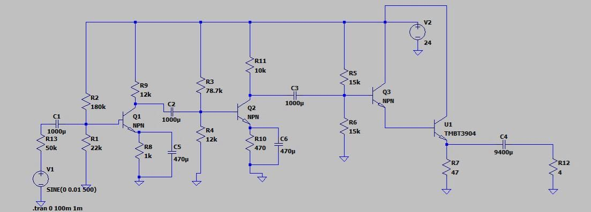
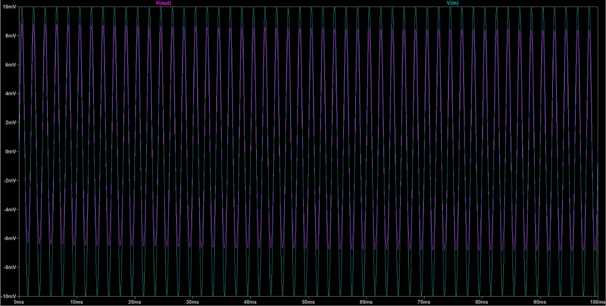
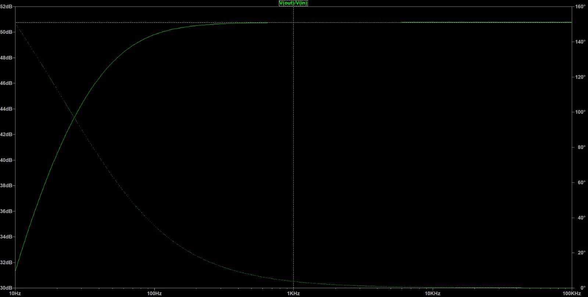

#  Amplificador BJT Multietapa


Proyecto de **diseño, análisis y simulación** de un amplificador de audio basado en **transistores BJT**.

El circuito está compuesto por **cuatro etapas de amplificación**:

- Dos etapas **emisor común** para obtener ganancia de voltaje.
- Dos etapas **seguidor de emisor** para aumentar la capacidad de corriente y manejar cargas de baja impedancia.

---

#  Especificaciones del Sistema

| Parámetro | Valor |
|----------|------|
| Voltaje de alimentación | 24 V |
| Transistores de señal | 2N3904 |
| Transistores de potencia | TIP41C |
| Número de etapas | 4 |
| Tipo de amplificador | Clase A discreto |
| Carga | 6 Ω |
| Ganancia aproximada | 285 |

---

#  Arquitectura del Amplificador

| Etapa | Configuración | Transistor | Función |
|------|---------------|-----------|--------|
| Etapa 1 | Emisor común | 2N3904 | Amplificación de voltaje |
| Etapa 2 | Emisor común | 2N3904 | Amplificación adicional |
| Etapa 3 | Seguidor de emisor | TIP41C | Buffer de corriente |
| Etapa 4 | Seguidor de emisor | TIP41C | Etapa de potencia |

Las dos primeras etapas generan la mayor parte de la **ganancia de voltaje**, mientras que las últimas etapas permiten **entregar mayor corriente a la carga**.

---

#  Esquema del Circuito

A continuación se muestra el diagrama del amplificador multietapa.



---

#  Simulación Temporal (.tran)

El análisis transitorio permite observar el comportamiento del amplificador en el dominio del tiempo.

Comando utilizado en SPICE:

````
.tran 0 100m
````

Resultado de la simulación:



En esta gráfica se puede observar la **señal de entrada** y la **señal de salida amplificada**.

---

#  Respuesta en Frecuencia (.ac)

El análisis AC permite estudiar la **ganancia del amplificador en función de la frecuencia**.

Comando utilizado:

````
.ac dec 100 1 1Meg
````

Resultado de la simulación:



Esta gráfica permite analizar:

- Ganancia del amplificador
- Banda de frecuencia de operación
- Comportamiento del circuito en diferentes frecuencias

---

#  Punto de Operación (Operating Point)

El punto de operación fue obtenido mediante el análisis `.op` en SPICE.

## Voltajes DC en nodos

| Nodo | Voltaje |
|-----|--------|
| V(b1) | 2.316 V |
| V(b2) | 1.925 V |
| V(b3) | 11.841 V |
| V(c1n) | 5.803 V |
| V(c2n) | 1.212 V |
| V(e1) | 1.532 V |
| V(e2) | 1.127 V |
| V(e4) | 10.135 V |
| V(n3) | 11.048 V |
| Vcc | 24 V |

---

## Corrientes en los transistores

| Transistor | Ib | Ic | Ie |
|-----------|------|------|------|
| Q1 | 15 µA | 1.516 mA | 1.531 mA |
| Q2 | 120 µA | 2.279 mA | 2.399 mA |
| Q3 | 21 µA | 2.113 mA | 2.135 mA |
| Q4 | 2.135 mA | 213.5 mA | 215.6 mA |

---

## Corrientes principales en resistencias

| Resistencia | Corriente |
|-------------|-----------|
| R7 | 215.6 mA |
| R8 | 1.531 mA |
| R9 | 1.516 mA |
| R10 | 2.399 mA |
| R11 | 2.279 mA |

---

## Consumo total del circuito

Corriente suministrada por la fuente:

I(VCC) ≈ 0.220 A


Potencia aproximada consumida:

P ≈ V × I, 
P ≈ 24V × 0.220A, 
P ≈ 5.28 W


---

#  Netlist SPICE

```spice
* Amplificador Multietapa BJT

VCC Vcc 0 DC 24
Vin In 0 AC 1 SIN(0 0.01 500)

***********************
* ETAPA 1 (EMISOR COMUN)
***********************

R13 In N1 50k
C1 N1 B1 1000u

R2 Vcc B1 180k
R1 B1 0 22k

R9 Vcc C1N 12k
R8 E1 0 1k
C5 E1 0 470u

Q1 C1N B1 E1 2N3904

***********************
* ETAPA 2
***********************

C2 C1N B2 1000u

R3 Vcc B2 78.7k
R4 B2 0 12k

R11 Vcc C2N 10k

R10 E2 0 470
C6 E2 0 470u

Q2 C2N B2 E2 2N3904

***********************
* ETAPA 3 (BUFFER)
***********************

C3 C2N B3 1000u

R5 Vcc B3 15k
R6 B3 0 15k

Q3 Vcc B3 N3 TIP41C

***********************
* ETAPA 4 (POTENCIA)
***********************

Q4 Vcc N3 E4 TIP41C

R7 E4 0 47

***********************
* SALIDA
***********************

C4 E4 OUT 9400u
R12 OUT 0 4

.model 2N3904 NPN
.model TIP41C NPN

.op
.ac dec 100 1 1Meg
.tran 0 100m

.end
